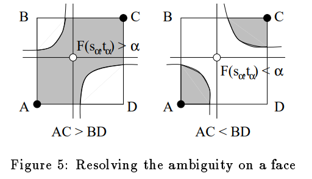

# Marching Cubes 纯 C++ 实现

在 Marching Cubes 算法中，主要存在 Ambitious face 和 Internal ambiguity 这两种歧义。如下图所示：

|歧义类型|Ambitious face|Internal ambiguity|
|---|--|---|
|歧义图例| ||
|产生原因|两对顶点正负情况对内一样，对间相反，导致可以有两种切分方式|内部到底是否联通不确定，导致同一个 configuration 可能产生不同的情况|
|解决方案|插值得到双曲线渐近线的交点的体素值（具体公式见论文），根据公式可以简化为比较 AC-BD 比较确定该选哪种方案NielsonHamann1991|看看能否找到中间的横截面，使得 AC > BD，如果可以找到，证明中间有区域是联通的|

解决了歧义之后，还需要对 256 种情况进行具体的分析，将其映射为 15 个大类（最初 MC 提出时的 15 种 base case），每个大类有几种小类代表歧义的不同解决方案。

参考 `marching_cubes_jgt` 这篇论文进行的实现（这篇文章给出了原始代码），能够解决原始 Marching Cubes 的歧义问题，保证生成的等值面一定是流形。这篇文章的方法也是 `skimage.measure.marching_cubes_lewiner` 实现的。

1. 将 256 种情况使用 case table 映射到 15 种大类，但是每一个还有自己的小类，用来解决歧义问题。
2. 根据 test table 对指定顶点进行检查，看应该使用哪个 face 歧义解决办法（separated or not），映射到对应的子类
3. 根据 tiling table 对指定的顶点进行验证，看看是否应该填充内部，映射到对应的子类

最后根据映射到的之类进行三角化，生成对应的三角形和法线。法线的计算和原始论文一致，cube 的顶点的[法线就是此处的梯度值]((https://zhuanlan.zhihu.com/p/62718992))，三角形顶点的法线由 cube 顶点的法线插值得来。法线的方向可以通过参数进行反向，只需修改求梯度的方向即可。

另外，还需要注意一些编号和方向，点线面的编号如下图所示：

数据结构上，以点 0 为例，往 x 方向走是 1，往 y 方向走是 3，往 z 方向走是 4。我们预先扫一遍整个体数据，将每个点 x, y, z 方向的边中点插值先预计算出来，方便之后的使用。先把所有的点存在 3 个数组里面，以每个 cube 的 0 点为索引的 x, y, z 方向上的点。注意只有边的两边正负性不同才有插值的必要，否则一定不会产生过这条边中间的点。

需要注意的是，在生成规则里面，为了确保内部正确，有些情况需要在 cube 正中心生成一个点，这个点标号为 12。

## 数据

一份 CBCT 数据，在 [Release 中](https://github.com/upupming/marching-cubes/releases/tag/v0.0.1)下载并放入 [data](data) 文件夹下。

## 踩坑点

- 梯度方向就是法向方向，按照公式默认的话法线指向的是增长最快的方向，对于 CBCT 来说，增长最快的方向是朝内的，所以会造成法线朝内绘制出来的 mesh 是灰色的，这个时候就需要使用 `reverseGradientDirection` 参数反向，对应 sklearn 的 `gradient=descending` 参数。
- 法线计算出来要记得归一化。法线支持两种不同的方向，供用户自己选择。
- 如果 cube 顶点值和 isoValue 相等，会出现顶点为 0 的情况，论文中都是没有提到怎么处理的，可以直接将其设为 `FLT_EPSILON`，不然的话后面计算边的插值点的时候会出问题（要么插值就是 cube 顶点，要么不插值，都是不对的，前者会造成三角形塌陷成两个点，后者会造成没有顶点用来构成三角形）

    

- OMP 加速之后算法需要 9s 左右，但是文件写入无法加速，21s 左右。
    - isoValue 800, 顶点数 4,256,478, 面数 8,165,228

- `assert(buf.bind())` 这样的写法是有问题的，因为 `Release` 模式下会忽略所有的 `assert` 语句，导致 bind 不执行，最终 `glDrawElements` 找不到 buffer 就报内存错误了。
- 将原有的三维数组改为 `unordered_ma`

细节展示：

膜拜这位论文作者，写了 2000 多行的 LookUpTable，而且每一个都是要考虑对应的细节的，感觉每种 case 如果要自己想真的是太难了。

4 篇经典的论文资料都放在了 [materials](materials) 文件夹下。

## 功能

- [x] 运行 Marching Cubes 生成带法线的顶点，所有的三角形（每个都带有 3 个顶点索引）
- [ ] 使用 OpenGL, imgui 或者 Qt 进行渲染
- [ ] 使用 Qt UI 组件调节等值面参数等得到不同的效果
- [ ] 使用 CUDA 进行加速

## 参考资料

1. [lorensen1987, cited by 17154](https://people.eecs.berkeley.edu/~jrs/meshpapers/LorensenCline.pdf)
    1. 最开始提出的 Marching Cubes 算法并没有解决歧义性问题，因此可能存在裂缝（crack），造成非流形的情况。
2. [Ambiguity in Marching Cubes](https://people.eecs.berkeley.edu/~jrs/meshpapers/NielsonHamann.pdf)
3. [Efficient implementation of Marching Cubes’ cases with topological guarantees](http://thomas.lewiner.org/pdfs/marching_cubes_jgt.pdf)
    1. 解决了歧义性问题，保证产生的等值面一定是流形，代价仅仅是引入了较大的 lookup table。
    2. [`skimage.measure.marching_cubes_lewiner`](https://scikit-image.org/docs/dev/api/skimage.measure.html?highlight=marching_cubes#skimage.measure.marching_cubes_lewiner)
    3. [THOMAS LEWINER's C++ implementation (ref for lookup table)](https://github.com/erich666/jgt-code/tree/master/Volume_08/Number_2/Lewiner2003/MarchingCubes)
    4. [Marching Cubes 33](http://www.cs.jhu.edu/~misha/ReadingSeminar/Papers/Chernyaev96.pdf)
    5. [The asymptotic decider](https://web.cs.ucdavis.edu/~hamann/NielsonHamann1991.pdf)
4. https://www.youtube.com/watch?v=Pi96vMb2r4M
5. https://github.com/tinyobjloader/tinyobjloader
